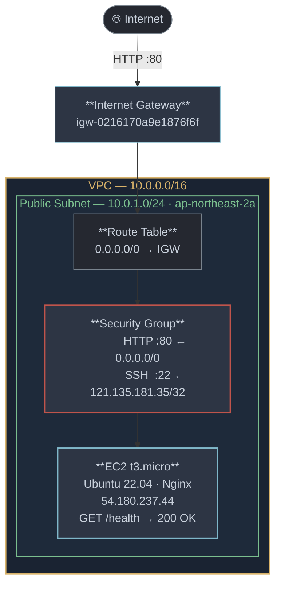

# b3-1 — AWS 웹 서비스 인프라 구축

VPC + EC2 + Nginx를 AWS CLI로 완전 자동화하여 구축한 클라우드 인프라 실습.

## 개발 환경

| 항목 | 내용 |
|---|---|
| Cloud | Amazon Web Services |
| Region | ap-northeast-2 (서울) |
| CLI | AWS CLI v2.34.14 |
| Instance | t3.micro (Free Tier) |
| OS | Ubuntu 22.04 LTS |
| Web Server | Nginx |

## 아키텍처



상세 다이어그램 (IAM 구조 + 트래픽 흐름): [docs/architecture.md](docs/architecture.md)

## 외부 접속 검증

**방식 B 선택**: `GET http://54.180.237.44/health`

```bash
$ curl http://54.180.237.44/health
OK

$ curl -o /dev/null -w "%{http_code}" http://54.180.237.44/health
200
```

- 응답: `200 OK` / 본문: `OK`

## 리소스 식별 정보

| 리소스 | ID |
|---|---|
| VPC | `vpc-023d852a3471ef158` |
| Public Subnet | `subnet-01c319e79337bc3b0` |
| Internet Gateway | `igw-0216170a9e1876f6f` |
| Route Table | `rtb-05896b293836ba38e` |
| Security Group | `sg-06a53efc080f4c3c6` |
| EC2 Instance | `i-05d106a3c3409edd4` |
| IAM User | `codyssey-b6-user` |

## IAM 최소권한

- 유저: `codyssey-b6-user`
- 정책: `B6LabMinimumPrivilege` (인라인)
- 허용 범위: EC2, VPC, Security Group 구성에 필요한 작업
- 제외: S3, RDS, Lambda 등 실습 무관 서비스 일체
- AdministratorAccess 미부여

정책 파일: [scripts/iam-policy.json](scripts/iam-policy.json)

## Security Group 규칙

| 방향 | 프로토콜 | 포트 | 소스 | 이유 |
|---|---|---|---|---|
| Inbound | TCP | 80 | 0.0.0.0/0 | 외부 HTTP 접근 허용 |
| Inbound | TCP | 22 | 121.135.181.35/32 | SSH — 개인 IP만 허용 |
| Outbound | All | All | 0.0.0.0/0 | apt, curl 등 아웃바운드 필요 |

전체 포트 허용(0-65535 to 0.0.0.0/0) 규칙 **미존재**.

## 제출 파일 구성

```
codyssey-b3-1/
├── README.md
├── docs/
│   ├── architecture.md        # 아키텍처 다이어그램 (Mermaid)
│   ├── troubleshooting.md     # 트러블슈팅 보고서 (3건)
│   └── cleanup-checklist.md   # 리소스 정리 체크리스트
└── scripts/
    ├── iam-policy.json        # IAM 최소권한 정책
    └── user-data.sh           # EC2 Nginx 자동설치 스크립트
```

## 리소스 정리

[docs/cleanup-checklist.md](docs/cleanup-checklist.md) 참조.
실습 종료 후 EC2 → IGW → VPC 역순으로 삭제.
