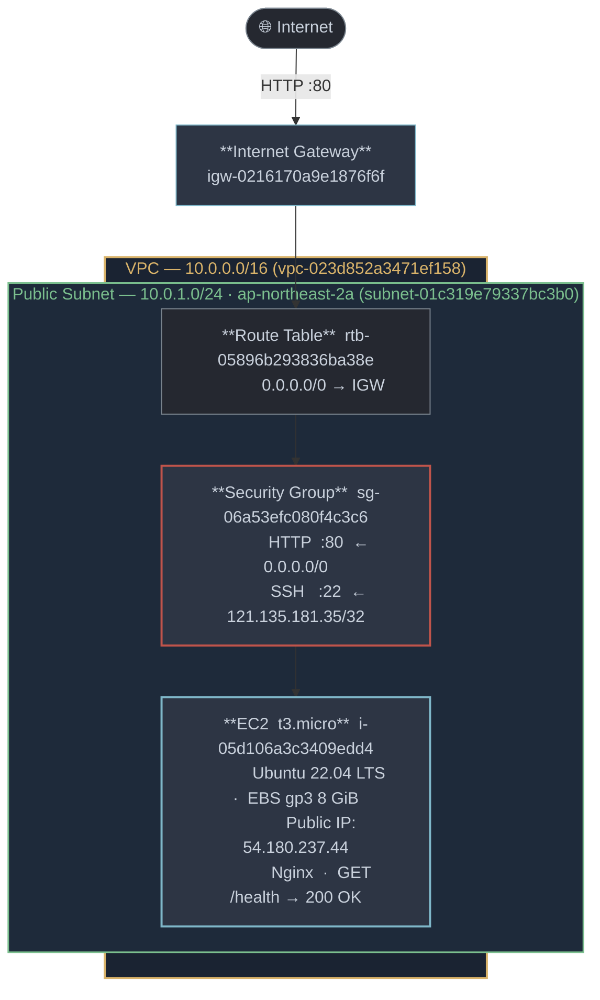
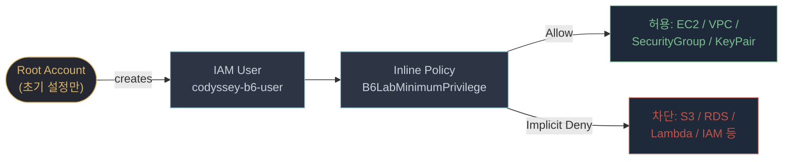
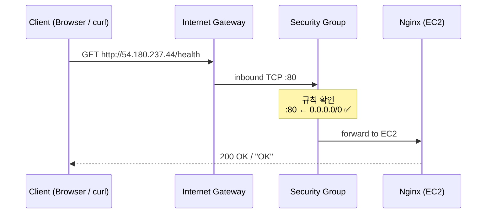

# 아키텍처 다이어그램 — b6-1

## 전체 구성

```mermaid
flowchart TD
    Internet(["🌐 Internet"])

    IGW["**Internet Gateway**
    igw-0216170a9e1876f6f"]

    subgraph VPC["VPC — 10.0.0.0/16  (vpc-023d852a3471ef158)"]
        subgraph Subnet["Public Subnet — 10.0.1.0/24  ·  ap-northeast-2a  (subnet-01c319e79337bc3b0)"]
            RT["**Route Table**  rtb-05896b293836ba38e
            0.0.0.0/0 → IGW"]

            SG["**Security Group**  sg-06a53efc080f4c3c6
            HTTP  :80  ←  0.0.0.0/0
            SSH   :22  ←  121.135.181.35/32"]

            EC2["**EC2  t3.micro**  i-05d106a3c3409edd4
            Ubuntu 22.04 LTS  ·  EBS gp3 8 GiB
            Public IP: 54.180.237.44
            Nginx  ·  GET /health → 200 OK"]
        end
    end

    Internet -->|"HTTP :80"| IGW
    IGW --> RT
    RT --> SG
    SG --> EC2

    style VPC     fill:#1a2332,stroke:#D9B36A,stroke-width:2px,color:#D9B36A
    style Subnet  fill:#1e2a3a,stroke:#7BBF8E,stroke-width:1.5px,color:#7BBF8E
    style IGW     fill:#2D3544,stroke:#7FB7C9,color:#C9D1DC
    style RT      fill:#252830,stroke:#7A848E,color:#C9D1DC
    style SG      fill:#2D3544,stroke:#C0544B,stroke-width:2px,color:#C9D1DC
    style EC2     fill:#2D3544,stroke:#7FB7C9,stroke-width:2px,color:#C9D1DC
    style Internet fill:#252830,stroke:#7A848E,color:#C9D1DC
```

## IAM 최소권한 구조

```mermaid
flowchart LR
    Root(["Root Account\n(초기 설정만)"])
    User["IAM User\ncodyssey-b6-user"]
    Policy["Inline Policy\nB6LabMinimumPrivilege"]
    Allowed["허용: EC2 / VPC /
    SecurityGroup / KeyPair"]
    Denied["차단: S3 / RDS /
    Lambda / IAM 등"]

    Root -->|creates| User
    User --> Policy
    Policy -->|Allow| Allowed
    Policy -->|Implicit Deny| Denied

    style Root    fill:#252830,stroke:#D9B36A,color:#D9B36A
    style User    fill:#2D3544,stroke:#7FB7C9,color:#C9D1DC
    style Policy  fill:#2D3544,stroke:#7FB7C9,color:#C9D1DC
    style Allowed fill:#1e2a3a,stroke:#7BBF8E,color:#7BBF8E
    style Denied  fill:#1e2a3a,stroke:#C0544B,color:#C0544B
```

## 트래픽 흐름

```mermaid
sequenceDiagram
    participant Client as Client (Browser / curl)
    participant IGW    as Internet Gateway
    participant SG     as Security Group
    participant Nginx  as Nginx (EC2)

    Client->>IGW: GET http://54.180.237.44/health
    IGW->>SG: inbound TCP :80
    Note over SG: 규칙 확인<br/>:80 ← 0.0.0.0/0 ✅
    SG->>Nginx: forward to EC2
    Nginx-->>Client: 200 OK / "OK"
```
